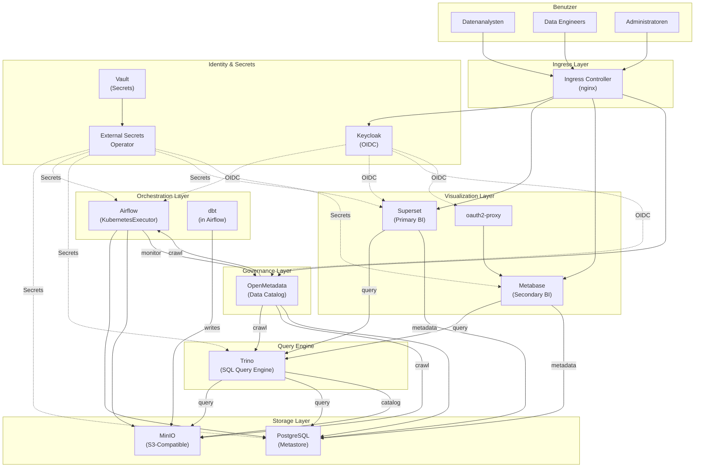

# Data Platform Architektur

## Überblick



## Komponenten-Übersicht

| Komponente | Version | Repository | HA | Skalierbarkeit |
|------------|---------|------------|-----|--------|
| **PostgreSQL** | 16.x | Bitnami (OCI) | Ja (Primary + Replica) | Vertikal |
| **MinIO** | 5.x | helm.min.io | Ja (4 Nodes, Erasure) | Vertikal |
| **Vault** | 1.x | hashicorp/vault | Ja (3 Replicas, Raft) | Vertikal |
| **External Secrets** | 0.9+ | charts.external-secrets.io | Ja | Horizontal |
| **Keycloak** | 22+ | Bitnami (OCI) | Ja (2 Replicas, Infinispan) | Horizontal |
| **Airflow** | 3.x | apache/airflow | Ja (Scheduler HA via celery) | Horizontal (Worker-Pods) |
| **dbt** | 1.9+ | (in Airflow-Image) | - | (via Airflow) |
| **Trino** | Latest | trinodb/charts | Ja (1 Coordinator + 3 Worker) | Horizontal (Worker) |
| **OpenMetadata** | 1.13+ | helm.open-metadata.org | Nein (1 Replica) | Vertikal |
| **Superset** | Latest | apache/superset | Ja (2 Replicas + Celery Worker) | Horizontal |
| **Metabase** | Latest | Community (pmint93) | Nein (1 Replica) | Vertikal |
| **oauth2-proxy** | 7.7+ | (custom template) | Nein (1 Replica) | Horizontal |

## Schichten-Architektur

### 1. **Storage Layer** (Persistenz)
- **PostgreSQL**: Shared Metastore für alle Apps (Airflow, OM, Superset, Metabase, Keycloak)
- **MinIO**: Object Store für Raw-Daten, dbt-Outputs, Logs
- **Funktionalität**: Datenablage, Transaktionalität, Suchindizes

### 2. **Orchestration Layer** (Workflows)
- **Airflow + dbt**: ETL-Pipelines, Datenmodellierung, Transformation
- **KubernetesExecutor**: Elastische Worker-Pods, bessere Ressourcennutzung
- **Funktionalität**: Zeitgesteuerte Prozesse, Fehlerbehandlung, Lineage-Tracking

### 3. **Query Engine** (Analytics SQL)
- **Trino**: Verteilte SQL-Query-Engine mit Multiple Connectors
- **Kataloge**: Hive (MinIO/S3), Iceberg, PostgreSQL
- **Funktionalität**: Adhoc-Queries, optimierte Performance, Federated Queries

### 4. **Governance Layer** (Metadaten & Compliance)
- **OpenMetadata**: Data Catalog, Asset Discovery, Compliance Tracking
- **REST-API zu Airflow**: Pipeline-Lineage-Tracking
- **Funktionalität**: Metadaten-Verwaltung, Datenqualität, Owner-Management

### 5. **Visualization Layer** (BI & Analytics)
- **Superset**: Primary BI-Tool (native Trino, Keycloak-OIDC)
- **Metabase**: Secondary BI-Tool (oauth2-proxy für SSO)
- **Funktionalität**: Dashboards, Ad-hoc-Berichte, Alerts, Self-Service Analytics

### 6. **Security & Identity Layer**
- **Keycloak**: Central IdP (OIDC), User-Management, Gruppen, Rollen
- **Vault**: Secrets Management, Dynamic Credentials, Audit-Logs
- **ExternalSecrets Operator**: Automatische Secret-Synced in K8s
- **NetworkPolicies**: Deny-by-default, explizite Allow-Rules
- **Funktionalität**: SSO, Secret-Rotation, Zero-Trust-Netzwerk

---

## Datenfluss

```
1. INGESTION
   Externe Daten → (sFTP/API/Batch) → MinIO (s3://data-raw)

2. ORCHESTRATION (Airflow)
   DAGs → Read MinIO → dbt Transformation → Write MinIO (s3://data-processed)
   
3. QUERY (Trino)
   Trino Catalogs:
   - minio (Hive) → s3://data-raw (raw tables)
   - iceberg → s3://data-processed (dbt models, ACID)
   - postgresql → direct access (operational DBs)

4. GOVERNANCE (OpenMetadata)
   Crawl Trino → Crawl Airflow (DAG lineage) → Crawl MinIO (assets)
   → Data Catalog UI

5. VISUALIZATION (Superset / Metabase)
   Superset/Metabase → Query Trino → Render Dashboards
```

---

## Skalierungsstrategie

### Horizontal Skalierbar (einfach)
- **Airflow Worker-Pods**: KubernetesExecutor erstellt Pods on-demand
- **Trino Worker-Pods**: Worker-Replicas erhöhen
- **Superset Webserver + Celery Worker**: Replicas erhöhen
- **ExternalSecrets**: Mehrere Controller-Instanzen

### Vertikal Skalierbar (schwierig)
- **PostgreSQL**: Nur Read-Replica ist horizontal; Primary bleibt single-node
  → Migrationsaufwand zu verteiltem System (CockroachDB, etc.)
- **MinIO**: Skalierung benötigt neuen Cluster (Expansion kompliziert)
- **OpenMetadata**: Single Pod, nur Speicher/CPU erhöhen möglich
- **Metabase**: Single Pod, nur Speicher/CPU erhöhen möglich

### Nicht Skalierbar (aktuell)
- **Keycloak**: 2-Node Infinispan-Cluster ist Limit (Bitnami Chart-Limitation)
- **Vault**: 3-Node Raft-Cluster (Raft begrenzt auf ODD-Zahl)

---

## Ressourcen-Anforderungen

### Produktion (Minimum)
- **CPU**: 20 Cores (Requests) / 40 Cores (Limits)
- **Memory**: 50 GB (Requests) / 100 GB (Limits)
- **Storage**: 1 TB (PostgreSQL) + 5 TB (MinIO) min.

### Development / Testing (auf Kind)
- **CPU**: 8 Cores
- **Memory**: 16 GB
- **Storage**: 50 GB

---

## Externe Abhängigkeiten

### Kubernetes (Out-of-Scope)
- Kubernetes 1.32+
- Ingress Controller (nginx)
- cert-manager
- StorageClass (ReadWriteOnce)

### Netzwerk
- DNS mit Wildcard-Unterstützung (`*.data-platform.example.com`)
- TLS-Zertifikate (Let's Encrypt oder custom CA)

### Monitoring & Logging (Optional, nicht in Chart)
- Prometheus (Scrape /metrics Endpoints)
- Grafana (Visualisierung)
- Loki/ELK Stack (Logs)
- Alertmanager (Alerting)

---

## Best Practices

1. **Data Governance**: Alle User-Management über Keycloak, nie direkt in Apps
2. **Secrets**: Nur über Vault, nie Klartext in values.yaml
3. **Backups**: PostgreSQL täglich exportieren, MinIO via Policies schützen
4. **Monitoring**: Health-Checks der Datenbanken, Vault-Status, Airflow-DAG-Status
5. **Updates**: Immer PostgreSQL/Vault zuerst, dann abhängige Services
6. **Netzwerk**: NetworkPolicies streng testen vor Production-Rollout
