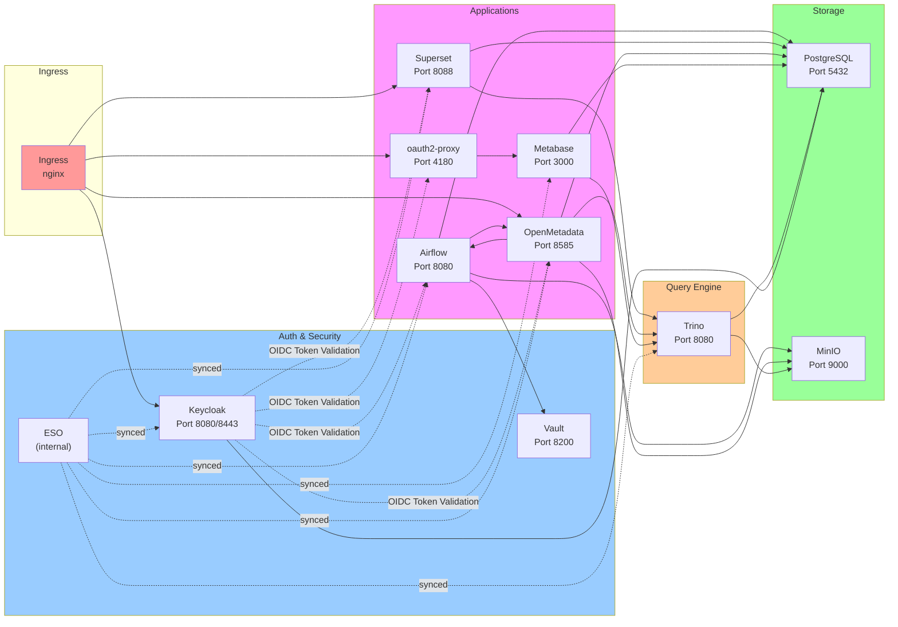

# Data Platform Networking

## Verbindungsmatrix

| Von | Nach | Port | Protokoll | Zweck |
|-----|------|------|-----------|-------|
| **Airflow → PostgreSQL** | 5432 | TCP | Metastore |
| **Airflow → MinIO** | 9000 | TCP | DAG-Artefakte, dbt-Output |
| **Airflow → Vault** | 8200 | TCP | Secret Sync (via ESO) |
| **Airflow → OpenMetadata** | 8585 | TCP | Pipeline-Metadaten REST |
| **Trino → MinIO** | 9000 | TCP | S3-Catalog-Queries |
| **Trino → PostgreSQL** | 5432 | TCP | PostgreSQL-Catalog |
| **OpenMetadata → Trino** | 8080 | TCP | Metadaten-Crawling |
| **OpenMetadata → Airflow** | 8080 | TCP | Pipeline-Metadaten REST |
| **OpenMetadata → MinIO** | 9000 | TCP | Storage-Metadaten |
| **OpenMetadata → PostgreSQL** | 5432 | TCP | OM Metastore |
| **Superset → Trino** | 8080 | TCP | SQL-Queries |
| **Superset → PostgreSQL** | 5432 | TCP | Superset App-DB |
| **Superset → Redis** | 6379 | TCP | Celery Broker |
| **Metabase → Trino** | 8080 | TCP | SQL-Queries |
| **Metabase → PostgreSQL** | 5432 | TCP | Metabase App-DB |
| **oauth2-proxy → Keycloak** | 8080/8443 | TCP | OIDC Token Validation |
| **oauth2-proxy → Metabase** | 3000 | TCP | Upstream |
| **Keycloak → PostgreSQL** | 5432 | TCP | Keycloak App-DB |
| **Keycloak ↔ Keycloak** | 7800 | TCP | Infinispan Clustering |
| **ESO → Vault** | 8200 | TCP | Secret Fetch |
| **Alle → Keycloak** | 8080/8443 | TCP | OIDC |
| **Alle → DNS** | 53 | UDP | Service Resolution |
| **Ingress → Airflow** | 8080 | TCP | UI |
| **Ingress → Superset** | 8088 | TCP | UI |
| **Ingress → Metabase** | 4180 | TCP | oauth2-proxy |
| **Ingress → OpenMetadata** | 8585 | TCP | UI |
| **Ingress → Keycloak** | 8080/8443 | TCP | UI + OIDC |

---

## NetworkPolicy-Übersicht



---

## Service Discovery (DNS)

Alle Services sind über Kubernetes DNS erreichbar:

```
<release-name>-<component>.<namespace>.svc.cluster.local
```

### Beispiele:
```
data-platform-postgresql:5432
data-platform-minio:9000
data-platform-airflow-webserver:8080
data-platform-trino:8080
data-platform-openmetadata:8585
data-platform-superset:8088
data-platform-metabase:3000
data-platform-keycloak:8080
data-platform-vault:8200
```

---

## Ingress Routing

```
Hostname → Service:Port
───────────────────────
airflow.data-platform.example.com    → data-platform-airflow-webserver:8080
bi.data-platform.example.com         → data-platform-superset:8088
catalog.data-platform.example.com    → data-platform-openmetadata:8585
metabase.data-platform.example.com   → data-platform-metabase-oauth2-proxy:4180
auth.data-platform.example.com       → data-platform-keycloak:8080
```

---

## Firewall-Regeln (Pseudo-Code)

```
# Standardmäßig alles ablehnen
DEFAULT: DENY

# Airflow
ALLOW Airflow → PostgreSQL:5432
ALLOW Airflow → MinIO:9000
ALLOW Airflow → Vault:8200
ALLOW Airflow → OpenMetadata:8585
ALLOW Airflow → Keycloak:8080
ALLOW Ingress → Airflow:8080

# Trino
ALLOW Trino → MinIO:9000
ALLOW Trino → PostgreSQL:5432
ALLOW Trino ↔ Trino:8080,8081 (cluster communication)
ALLOW Superset → Trino:8080
ALLOW Metabase → Trino:8080
ALLOW OpenMetadata → Trino:8080

# PostgreSQL
ALLOW Airflow → PostgreSQL:5432
ALLOW OpenMetadata → PostgreSQL:5432
ALLOW Superset → PostgreSQL:5432
ALLOW Metabase → PostgreSQL:5432
ALLOW Keycloak → PostgreSQL:5432

# Keycloak
ALLOW Ingress → Keycloak:8080,8443
ALLOW Keycloak ↔ Keycloak:7800 (Infinispan clustering)
ALLOW Airflow → Keycloak:8080
ALLOW Superset → Keycloak:8080
ALLOW OpenMetadata → Keycloak:8080
ALLOW oauth2-proxy → Keycloak:8080

# Vault & ESO
ALLOW ESO → Vault:8200
ALLOW All → DNS:53
```

---

## Fehlerbehebung

### Connection Refused vs. Timeout

- **Refused** (113): Ziel läuft nicht oder Port falsch
  ```bash
  curl -v http://service:port
  # Connection refused
  ```

- **Timeout** (110): Ziel läuft, aber NetworkPolicy blockiert
  ```bash
  curl -v --connect-timeout 5 http://service:port
  # Connection timeout
  ```

### Debugging

1. **Test-Pod starten:**
   ```bash
   kubectl run -it --rm debug --image=curlimages/curl:8.0.0 --restart=Never -- sh
   ```

2. **Service-Erreichbarkeit testen:**
   ```bash
   curl -v http://data-platform-postgresql:5432 2>&1
   curl -v http://data-platform-minio:9000 2>&1
   curl -v http://data-platform-keycloak:8080/health 2>&1
   ```

3. **NetworkPolicy prüfen:**
   ```bash
   kubectl get networkpolicies
   kubectl describe networkpolicy <policy-name>
   ```

4. **DNS prüfen:**
   ```bash
   nslookup data-platform-postgresql
   nslookup data-platform-postgresql.default.svc.cluster.local
   ```

---

## Security Best Practices

1. **NetworkPolicy immer aktiviert**: `networkPolicies.enabled: true` in values.yaml
2. **Monitoring von Verbindungen**: Prometheus-Alerts für gescheiterte Connections
3. **Regelmäßige Policy-Audits**: NetworkPolicies nach jedem Service-Update prüfen
4. **Pod-Label Konsistenz**: Alle Pods müssen korrekte Labels haben für Policy-Matching
